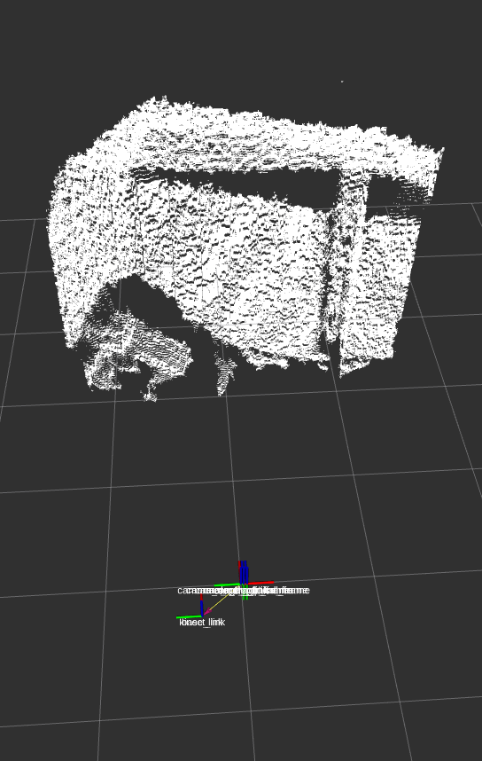
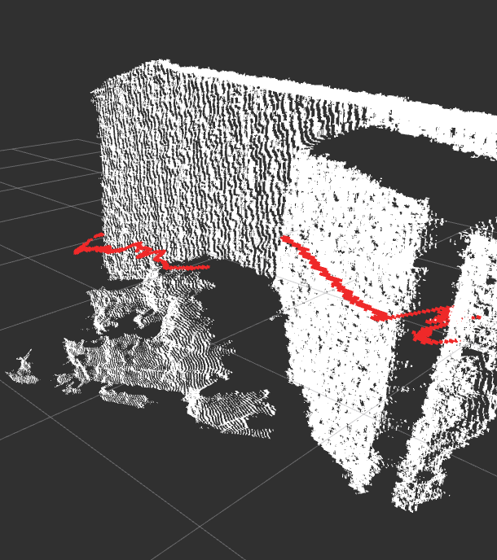

## Navigation Wheelchair


### Installation
At first to start the system we need to install the move_base package
```
sudo apt install ros-noetic-navigation
```

With this package includes ``amcl``, ``costmap_2d``, ``move_base``, ``dwa_local_planner`` ... and many more.

For more details you can use the following link
http://wiki.ros.org/navigation?distro=noetic

With this some planning algorithms are already installed and can be used like ``navfn``, ``global_planner`` and ``carrot_planner`` for global planning 
and ``dwa_local_planner`` and ``base_local_planner`` for local planning.


Inside our wheelchair we also want to test the ``teb_local_planner`` with its time elastic band methode. 

```
sudo apt install ros-noetic-teb-local-planner
```

Inside the simulation file we also use ``ira_laser_tools`` for merging two laser scan data
```
sudo apt install ros-noetic-ira-laser-tools
```

We also use the twist_recovery package for a more flexible recovery behaviour system.
```
sudo apt install ros-noetic-twist-recovery
```

### Launch
The lauch of the simulation file:
```
roslaunch navigation navigation_nursing_home_sim.launch
```
The amcl lauch file will be automatically started inside ``navigation_nursing_home_sim.launch``. 
A premade map of a replicated nursing home will be launched inside of gazebo. For better overview of all the data that will be sent rviz is also going to be opened.

### Planner
Inside the params Folder you can change params of the costmaps, some global_planner and some local_planner.

global_planner:

- carrot_global_planner (just a straight line from point A to point B)
- global_global_planner (Extension of navfn with possibility to use A* in addition to Dijkstra)
- navfn_global_planner (uses Dijkstra)

local_planner:

- dwa_local_planner (Dynamic Window Approach)
- trajectory_local_planner (Dynamic Window Approach)
- tep_local_planner (Time Elastic Band)

The best planners for the Raspberry Pi 4 where `global_planner` because it can use A* and is more flexible than navfn. And for the local planner `dwa_local_planner` because of omnidirektional driving and the low power requirement (controll loop can be achieved).

## Kinect
A Kinect is to be used for the detection of chairs, tables and objects that cannot be detected with the 2D lidars. The 3D point cloud of the Kinect's depth sensor is translated into a 2D laser scan, which is used for the costmaps of the navigation in a merged form together with the lidars.
### Installation
I am following the guide from:
https://aibegins.net/2020/11/22/give-your-next-robot-3d-vision-kinect-v1-with-ros-noetic/

We are using the freenect drivers witch will be installed with the following commands

Update your system:
```
sudo apt-get update
sudo apt-get upgrade
```

Install the dependencies:
```
sudo apt-get install git-core cmake freeglut3-dev pkg-config build-essential libxmu-dev libxi-dev libusb-1.0-0-dev
```

Get the libfreenect repository from GitHub:
```
git clone git://github.com/OpenKinect/libfreenect.git
```

Make and install:
```
cd libfreenect
mkdir build
cd build
cmake -L ..
make
sudo make install
sudo ldconfig /usr/local/lib64/
```

To use kinect without sudoing every time:
```
sudo adduser $USER video
sudo adduser $USER plugdev
```

Next we will add some device rules:
```
sudo nano /etc/udev/rules.d/51-kinect.rules
```

Paste the following and save it:
```
# ATTR{product}=="Xbox NUI Motor"
SUBSYSTEM=="usb", ATTR{idVendor}=="045e", ATTR{idProduct}=="02b0", MODE="0666"
# ATTR{product}=="Xbox NUI Audio"
SUBSYSTEM=="usb", ATTR{idVendor}=="045e", ATTR{idProduct}=="02ad", MODE="0666"
# ATTR{product}=="Xbox NUI Camera"
SUBSYSTEM=="usb", ATTR{idVendor}=="045e", ATTR{idProduct}=="02ae", MODE="0666"
# ATTR{product}=="Xbox NUI Motor"
SUBSYSTEM=="usb", ATTR{idVendor}=="045e", ATTR{idProduct}=="02c2", MODE="0666"
# ATTR{product}=="Xbox NUI Motor"
SUBSYSTEM=="usb", ATTR{idVendor}=="045e", ATTR{idProduct}=="02be", MODE="0666"
# ATTR{product}=="Xbox NUI Motor"
SUBSYSTEM=="usb", ATTR{idVendor}=="045e", ATTR{idProduct}=="02bf", MODE="0666"
```


Now we need to generate audio drivers for support, run the following to get ‘audios.bin’ file. Open a terminal inside the freenect folder and type,
```
python3 src/fwfetcher.py
```

Now we need to copy ‘audios.bin’ to a specific location.
```
sudo cp src/audios.bin /usr/local/share/libfreenect
```


Now the Kinect drivers are ready and you can make it work in ROS.

Inside your `catkin_ws`:
```
cd ~/catkin_ws/src
git clone https://github.com/ros-drivers/freenect_stack.git
```
Now we will use catkin make command to get the ROS on our system to recognise the examples.
```
cd ..
catkin_make
```

To start the Kinect and get data in ROS you need to launch:
```
roslaunch freenect_launch freenect.launch depth_registration:=true
```

Now you can see the depht cloud in `rviz`



### Translation to lasescan
`depthimage_to_laserscan` is a package of ROS witch can be use for it. You can chose the hight of the depth image witch is converted to lase data. We use at the moment a hight of 200px in height which will be converted to laserscan data.

Installation:
```
sudo apt install ros-noetic-depthimage-to-laserscan
```
The result can be seen below:




### Merging
We merge kinect laser data with the already merged scan data of the two Lidar Systems with `ira_laser_tools` there the laserscan_multi_merger is used.

Installation:
```
sudo apt install ros-noetic-ira-laser-tools
```

 data")